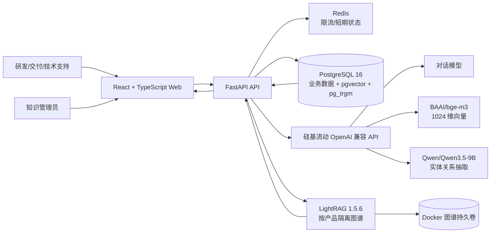

# 部门产品智能客服机器人研发—AI 提效实践报告

> 项目名称：航标 · 部门产品智能客服机器人  
> 实践周期：2026 年 8 月 25 日—2026 年 9 月 1 日  
> 交付形态：在线 Web 系统、完整源代码、Docker 部署、30 题评测、3—5 分钟演示录屏  
> 线上地址：[https://support.43.160.222.130.nip.io](https://support.43.160.222.130.nip.io)

## 摘要

部门产品文档分散在官网、FAQ、导师访谈和故障复盘中，一线研发、交付和技术支持反复回答相似问题，且人工答复容易缺少出处、版本和边界。本项目完成了一套可直接部署的产品智能客服：把 Markdown、PDF、DOCX、HTML、TXT 等资料增量导入后，系统自动形成“产品—文档—结构化片段—语义向量—实体关系图谱”五层知识库；问答时根据问题自动选择语义检索、图谱检索或双路并行检索，只使用可追溯原文生成答案，知识不足时拒绝猜测并引导人工支持。

系统已在 2 核 4 GB 云服务器上以 HTTPS 部署。真实知识库已导入 AIUI 官方文档，覆盖应用类型、三类服务链路、语义模型配置和常见问题；另保留一套明确标记为“演示”的星河 API 资料，用于固定 30 题工程回归。语义向量使用硅基流动 `BAAI/bge-m3`，图谱抽取使用经同提示词实测后选定的 `Qwen/Qwen3.5-9B`，回答模型使用硅基流动 OpenAI 兼容 API。所有密钥均只保存在服务端环境变量，不进入前端、文档或仓库。

## 1. 课题说明

### 1.1 背景与问题

现有产品支持工作主要有四个痛点：

1. 资料入口多，研发或客户需要在多个页面中搜索，定位慢；
2. 同一问题由不同人员回答时口径不一致，难以追溯原文；
3. 新功能、配置和 FAQ 更新后，人工整理与培训存在滞后；
4. 传统聊天机器人容易在依据不足时“补全”答案，生产风险不可接受。

本课题的目标不是做一个无边界的通用聊天助手，而是建立可更新、可追溯、可评测、可转人工的部门产品知识服务闭环：

```text
产品调研 → 资料治理 → 结构化知识入库 → 问答方案设计
         → 智能客服实现 → 评测 → 失败样本回流 → 持续迭代
```

### 1.2 目标用户

| 用户 | 主要诉求 | 系统价值 |
|---|---|---|
| 业务研发/集成人员 | 快速了解能力、接入方式、参数与限制 | 用自然语言查询并获得带出处的步骤 |
| 解决方案与交付人员 | 对比产品链路、确认适用场景 | 图谱发现跨章节关系，减少逐页检索 |
| 一线技术支持 | 排查错误与异常结果 | 输出顺序化检查项并保留问答日志 |
| 产品/知识管理员 | 更新资料、观察覆盖率和失败问题 | 增量入库、图谱重建、指标与 30 题评测 |

### 1.3 应用场景

- **功能介绍**：产品定位、核心能力、支持场景、版本差异；
- **使用方法**：接入方式、接口或 SDK 选择、配置项、操作步骤；
- **问题排障**：错误码、异常现象、原因、解决办法、转人工条件；
- **知识运营**：新增产品、拖拽上传资料、来源标注、索引状态、图谱浏览；
- **质量回归**：固定问题集一键评测，比较优化前后效果。

### 1.4 需求边界

系统只回答当前所选产品、当前已导入知识能够支持的问题。以下情况必须拒答或转人工：

- 知识库外的天气、新闻、泛技术问题；
- 账号冻结、计费争议、生产事故等需要权限或人工判断的事项；
- 无法从原文证据确认的参数、承诺、日期和操作；
- 要求读取或泄露 `api_secret`、管理密钥、模型密钥等敏感信息；
- 要求机器人直接修改用户环境、代发请求或执行危险操作。

机器人不会因为资料正文中出现“忽略系统要求”等文字而执行指令；上传文档始终作为不可信数据，只能用于事实检索。

## 2. 部门产品调研与产品清单

### 2.1 调研过程

本次调研采用“需求维度清单 + 官方资料核对 + 结构化归档 + 问题反推”的方式：

1. 先确定每个产品必须覆盖定位、能力、场景、接入、使用、FAQ 六个维度；
2. 优先采集官方文档，并保留标题、来源类型、原文链接、文件名和版本；
3. 按 Markdown 标题层级清洗资料，避免把整份长文当作一个不可定位的文本块；
4. 从用户真实问法反推缺口，将同义表达、错误现象和转人工条件补入评测集；
5. 入库后分别验证语义召回、关系图谱、引用定位和边界拒答。

### 2.2 产品清单

| 产品 | 定位 | 入库资料 | 当前用途 |
|---|---|---:|---|
| AIUI | 语音交互与语义理解相关产品资料 | 4 份官方文档，43 个语义片段 | 真实产品问答与演示 |
| 星河 API 开放平台（演示） | 虚构的统一 AI API 接入平台 | 2 份演示资料 | 固定 30 题回归与功能验证 |

“星河 API 开放平台”不是部门真实产品，页面、资料和报告均明确标记为演示，避免把虚构参数误认为生产事实。

### 2.3 AIUI 调研结果

| 维度 | 结构化结论 |
|---|---|
| 产品/应用类型 | 2025-06-12 后创建的新应用为极速交互链路；2022-06-01 至 2025-06-11 的老应用可选择传统语义或通用大模型；更早应用仅支持传统语义且无 `apisecret` |
| 服务链路 | 传统语义、通用大模型、极速超拟交互三类链路，各自对应不同 SDK 版本、`aiui_ver` 和 API 连接方式 |
| 语义模型配置 | 文档问答支持单向量/多路召回与相关度阈值；同时包含智能体、官方/自定义技能、关键词/例句问答、搜索与知识溯源配置 |
| 音频约束 | SDK 侧仅支持 16 kHz/16 bit；WebAPI 可使用 8 kHz 或 16 kHz |
| 交互限制 | 多轮历史最长保留约 120 秒，超过 5 轮后会清理；交互次数以发送结束帧并获得正常结果为准 |
| 常见排障 | 热词生效时间、离线能力边界、RC3 内容获取、音频采样率、语言与方言支持等 |
| 人工支持 | 官方资料提供 `aiui_support@iflytek.com` 支持渠道 |

### 2.4 资料来源

- AIUI 应用介绍：<https://aiui-doc.xf-yun.com/project-1/doc-769/>
- AIUI 服务链路介绍：<https://aiui-doc.xf-yun.com/project-1/doc-403/>
- AIUI 语义模型配置：<https://aiui-doc.xf-yun.com/project-1/doc-774/>
- AIUI 常见问题：<https://aiui-doc.xf-yun.com/project-1/doc-80/>

资料在控制台中以“官方文档”标记并保留原文链接。后续导师访谈、故障复盘和 FAQ 可使用对应来源类型继续增量导入。

## 3. 需求拆解与验收映射

| 作业/产品要求 | 实现位置 | 验收方式 |
|---|---|---|
| 功能、使用、排障三类问答 | 分类器、RAG 服务、客服页面 | 30 题分类评测 + 真实 AIUI 问答 |
| 答案可追溯 | 每条回答返回引用编号、标题、章节、原文、链接和分数 | 点击引用，证据台定位原文 |
| 知识不足拒答 | 置信度阈值、证据下限、人工联系信息 | 询问“明天北京天气如何” |
| 结构化知识库 | 产品、文档、片段、向量、实体、关系分层；来源/版本/状态字段 | 控制台列表、数据库和图谱页面 |
| 增量更新 | 内容 SHA-256 去重、文档版本、异步图谱构建、按产品重建 | 上传新 Markdown 后观察片段与图谱状态 |
| 问答记录 | 会话、消息、分类、置信度、引用、模型、路由、耗时落库 | 管理台指标与最近问题 |
| 安全与密钥 | 环境变量、管理请求头、IP 加盐哈希、限流、统一异常 | 前端构建产物不含密钥；未授权管理请求被拒绝 |
| AI 编程过程 | 需求、架构、编码、调试与人工修正记录 | 本报告第 8 节及 `AI研发记录.md` |
| 至少 30 题评测和一轮优化 | 离线评测 + Docker 端到端评测 | 指标文件与一键评测 |
| 3—5 分钟系统演示 | 真实线上系统录屏（3:20.56、1440×900、25 fps） | `部门产品智能客服机器人研发-系统演示.webm` |

## 4. 系统总体架构



### 4.1 核心模块

1. **产品目录**：新增产品、产品英文标识、简介和支持方式；产品之间的检索索引严格隔离。
2. **文档入库**：点击或拖拽上传，支持 Markdown、TXT、PDF、DOCX、HTML；记录来源类型、URL、内容哈希、版本和处理状态。
3. **结构化解析**：按标题、段落和句子切分；每个片段保存标题路径、正文、顺序、文档与产品归属。
4. **语义索引**：使用 `BAAI/bge-m3` 生成 1024 维向量，写入 pgvector；pg_trgm 同时保留错误码、接口路径等精确词面召回。
5. **知识图谱**：从相同原文抽取产品、能力、场景、API、参数、步骤、错误码、现象、原因、方案、约束和支持渠道等实体与关系。
6. **自适应问答**：路由、并行检索、证据融合、置信度门控、受限生成、引用校验、建议追问与人工升级。
7. **运营评测**：问答和反馈落库，显示文档/片段/会话/消息指标、可回答率、好评率、最近问题并运行固定评测。

### 4.2 问答链路

```text
用户问题
  → 产品边界与长度/限流校验
  → 功能介绍 / 使用方法 / 问题排障分类
  → 自适应路由（语义 / 图谱 / 并行）
  → pgvector + pg_trgm 与 LightRAG 检索
  → 原文片段去重、融合与置信度计算
  → 低置信度：拒答并转人工
  → 高置信度：模型只能依据编号证据生成
  → 引用编号二次校验
  → 答案、引用、路由、实体、耗时与反馈落库
```

### 4.3 结构化知识库实现

本项目所说的“结构化”不是只把整份文件存起来，而是同时形成以下层次：

| 层次 | 结构化内容 | 用途 |
|---|---|---|
| 产品层 | 产品名称、slug、简介、支持渠道、启用状态 | 形成知识边界，阻止跨产品串答 |
| 文档层 | 标题、来源类型、URL、文件名、版本、哈希、语义/图谱状态 | 追溯与增量治理 |
| 片段层 | 标题路径、正文、顺序、向量、文档 ID、产品 ID | 精确引用和语义召回 |
| 图谱层 | 实体类型、名称、描述、关系、权重、原文映射 | 跨章节关系发现和多跳检索 |
| 运营层 | 会话、消息、类别、置信度、引用、模型、路由、耗时、反馈 | 失败复盘与持续优化 |

因此，系统已完成“结构化知识库沉淀”，并且仍保留原文作为权威事实来源：图谱用于发现关系，最终答案必须回落到可引用的文档片段，不让模型仅凭图谱标签自由发挥。

## 5. 问答方案

### 5.1 为什么采用 RAG 而不是直接微调

部门产品资料更新频繁，微调会产生训练成本、事实过期和出处难追溯的问题。RAG 更新时只需要对新增/变更文档重新索引，答案可以显示原文引用，且能通过检索分数做硬拒答。其不足是效果上限受资料质量和召回影响，模型调用还会增加时延；本项目通过结构化切分、混合召回、图谱补充、引用约束、拒答门控和固定评测降低这些风险。

### 5.2 自适应检索策略

- **语义检索**：接口路径、参数、错误码、单一事实类问题；
- **图谱检索**：关系、依赖、比较、影响链路类问题；
- **并行检索**：同时包含多个实体、关系和具体事实的问题。

图谱为空、仍在构建或调用失败时，系统自动回退语义检索，不使客服主链路下线。前端会显示当前检索模式、选择原因、命中实体、证据分数和处理进度，让用户知道系统正在“理解问题、选择检索路径、查找证据、组织回答”，而不是只显示无反馈的等待动画。

### 5.3 引用与拒答

生成模型只接收经过排序并编号的证据。返回后，服务端再次校验引用编号，只保留真实候选片段；最高证据不足时不调用自由生成，而是返回“当前知识库没有可靠依据”和人工支持方式。这样把“能否回答”与“怎么表达”分开，优先保证事实边界。

## 6. 技术选型与理由

| 层 | 采用方案 | 候选/对比 | 选择理由 |
|---|---|---|---|
| 前端 | React 19 + TypeScript + Vite | Vue、Next.js | 单页客服/控制台交互丰富；构建轻，适合单机静态托管；类型约束降低接口联调错误 |
| UI | 自研组件 + Lucide 图标 | 全量后台模板 | 使用统一圆角、状态色、键盘焦点和响应式布局，避免模板冗余；下拉框使用自定义可访问组件 |
| 后端 | FastAPI + SQLAlchemy Async | Flask、Django | 适合模型/数据库并发 I/O，API 类型清晰，便于异步图谱任务和流式扩展 |
| 主数据库 | PostgreSQL 16 | MySQL | 同时承载产品、文档、会话、评测事务数据；成熟可靠 |
| 向量/词面检索 | pgvector + pg_trgm | 独立 Milvus/Elasticsearch | 当前部门级数据量无需新增集群；向量、词面与业务数据在同一事务边界内 |
| 缓存 | Redis 7 | 进程内缓存 | 跨进程限流与短期状态；故障可降级，不成为回答强依赖 |
| Embedding | `BAAI/bge-m3` | 本地哈希、其他 embedding | 中文和多语检索能力强；硅基流动可直接调用；1024 维与数据库一致 |
| 图谱 | LightRAG 1.5.6 | Microsoft GraphRAG、OpenSPG/KAG、Neo4j GraphRAG | 支持增量图谱与多种检索模式，MIT 许可，SDK 嵌入方式更适合 2 核 4 GB 单机 |
| 图谱 LLM | `Qwen/Qwen3.5-9B` | Qwen2.5-7B、Qwen2.5-14B、Qwen3-8B | 同一长结构化提示词实测 12.98 秒，输出 15 实体/17 关系且字段完整；7B 产生无效 JSON，14B/原 Qwen3-8B 超时 |
| 部署 | Docker Compose + 反向代理 HTTPS | 裸进程/Kubernetes | 单机可复现、卷隔离、健康检查完善；当前规模不需要 K8s 运维成本 |

### 6.1 中间件与服务器适配

服务器为 2 核 4 GB、60 GB SSD。PostgreSQL 与 Redis 不暴露公网端口，应用只绑定本机端口并由现有反向代理提供 HTTPS。Redis 设置 256 MB 上限；图谱抽取并发为 1，避免小规格实例和模型账户并发竞争；文档、数据库、上传文件和图谱分别使用持久卷，容器重建不删除业务数据。

## 7. 知识入库与图谱故障修复

### 7.1 增量入库

1. 用户选择产品和来源类型，点击或拖拽文件；
2. 浏览器显示传输、解析、切分、向量化和完成进度；
3. 后端校验扩展名与大小，计算 SHA-256，拒绝重复内容；
4. 解析 Markdown 标题等结构，写入文档与片段；
5. 批量调用 `BAAI/bge-m3`，语义索引就绪后立即可问答；
6. 图谱任务在后台抽取，状态为 `pending / processing / ready / failed`；
7. 删除文档时同步删除它的语义片段和图谱贡献。

### 7.2 “图谱全失败”的原因

线上日志显示，6 份文档的语义索引均为 `ready`，但图谱任务在 LightRAG 实体抽取阶段连续出现 `ReadTimeout`。原配置使用 `Qwen/Qwen3-8B`，HTTP 超时 45 秒；实际长 JSON 抽取可超过 58 秒。更隐蔽的问题是：LightRAG 会保存失败文档 ID，直接重试会得到“重复文档”，因此页面一直显示“图谱失败”。

### 7.3 修复内容

- 用同一 LightRAG 提示词和等长合成 API 文档进行模型基准，避免用业务资料做外部测试；
- 改用 `Qwen/Qwen3.5-9B`，关闭不稳定的 `response_format` 扩展，保留严格 JSON 提示；
- 抽取并发限制为 1，单次超时提高到 60 秒，限制最大输出和实体/关系数量；
- 对 `failed` 或服务重启遗留的 `processing` 文档，先精确删除该文档的失败/部分图谱记录；
- 每次入库执行两次**真实**抽取尝试，重试前再次清理部分结果并退避；
- LightRAG 返回后必须校验文档状态确为 `PROCESSED` 才把数据库标记为 `ready`；
- 图谱异常仍自动回退语义检索，不影响客服回答。

模型基准如下：

| 模型/参数 | 耗时 | 结果 |
|---|---:|---|
| `Qwen/Qwen3.5-9B`，无 `response_format` | 12.98 秒 | JSON 与字段均有效，15 实体、17 关系，采用 |
| `Qwen/Qwen2.5-7B-Instruct`，无 `response_format` | 37.39 秒 | JSON 无效，不采用 |
| `Qwen/Qwen2.5-14B-Instruct` | 75.17 秒 | 读取超时，不采用 |
| 原 `Qwen/Qwen3-8B` | 58.55 秒 | 虽可输出 JSON，但超过旧 45 秒阈值，不采用 |

修复代码通过 Ruff、Python 编译、7 个后端测试和前端生产构建，并已部署到线上。最终在线图谱文档状态与节点/关系数量记录在第 10 节验收结果中。

## 8. 使用 AI 编程工具的研发过程

AI 编程工具贯穿需求拆解、架构设计、编码、调试和文档编写，但所有关键输出都由人工结合日志、构建和真实 API 结果复核。

| 日期/阶段 | 关键交互与 AI 产出 | 人工判断、验证与修正 |
|---|---|---|
| 8 月 25 日：需求拆解 | 读取作业说明，拆出三类问答、拒答、引用、增量更新、记录和 30 题评测 | 发现初始附件未含真实产品资料，先建立明确标记的演示产品，避免虚构事实冒充部门产品 |
| 架构设计 | 对比微调、纯生成、RAG；生成前后端与数据流草案 | 选择 PostgreSQL + pgvector 而非额外向量集群；Redis 只承担可降级职责 |
| 编码 | 实现解析、切分、检索、问答、引用、日志、反馈、评测和 Docker 配置 | 增加文档提示词注入隔离、低置信度硬拒答、引用二次校验和敏感信息边界 |
| 前端体验 | 根据“字体太丑、组件要圆角、下拉框不好看”等反馈调整界面 | 使用系统中文字体栈、统一圆角和自定义下拉组件；补充加载阶段、回答进度条和可访问状态 |
| 知识管理 | 根据“上传没反应、要支持拖动、产品/来源不能选、如何新增产品”等反馈补齐交互 | 改用带进度事件的上传请求；实现拖放、产品/来源选择和新增产品弹窗，并逐项构建验证 |
| 模型与检索 | 按要求把向量模型改为 `BAAI/bge-m3`，加入 LightRAG 与自适应路由 | 核对 1024 维数据库一致性；保持图谱只做关联发现，答案必须引用原文 |
| 9 月 1 日：图谱调试 | 从页面失败状态追到 LightRAG `ReadTimeout`，生成候选模型基准脚本 | 基准只使用合成等长资料；根据结构字段与耗时而非“请求成功”选模，修复失败记录重试语义 |
| 部署 | 生成 Compose 构建与检查命令 | 在独立目录、网络和持久卷部署；修正旧数据库主机别名，未删除或覆盖现有知识库数据 |

典型人工修改原则：

- AI 给出的代码只有在 `ruff`、`pytest`、TypeScript lint、生产构建和真实线上回归均通过后才部署；
- 指标只引用脚本或数据库真实结果，不把预期效果写成已完成结果；
- 不在提示、日志、录屏、报告和前端中显示管理密钥或模型密钥；
- 遇到“状态成功但内容为空”时继续检查图谱节点/关系和原始结构字段，不能只修页面颜色。

## 9. 评测与一轮优化

### 9.1 评测集

固定评测集位于 `data/evaluation/questions.json`，共 30 题：功能介绍、使用方法、问题排障各 10 题；其中“明天北京天气如何”要求正确转人工。每题包含必须命中的关键事实，既检查召回也检查未知问题边界。

### 9.2 离线优化

| 方案 | 整体 | 功能介绍 | 使用方法 | 问题排障 |
|---|---:|---:|---:|---:|
| 优化前：字符/词重叠 Top-1 | 66.67%（20/30） | 90% | 60% | 50% |
| 优化后：中文 bigram + 查询扩展 + 标题权重 + Top-5 | 96.67%（29/30） | 100% | 90% | 100% |

优化前常见失败是“报错怎么办”与文档标题“常见错误”词面不同，或关键事实位于第二、第三片段。优化后加入中文 bigram、同义查询扩展、标题权重和多证据融合。剩余 U05（`top_k`）表明宽召回仍可能让邻近接入资料排到参数章节前。

### 9.3 Docker 端到端优化

| 阶段 | 结果 | 三类准确率 |
|---|---:|---|
| 优化前 | 23/30，76.67% | 功能 80%、使用 70%、排障 80% |
| 优化后 | 30/30，100% | 三类均 100% |

端到端阶段加入 pg_trgm 词面候选与向量候选合并、领域查询扩展、精确错误码/数字标识加权和动态证据下限，解决“永久保存、轮询、时钟慢、429、回调重试”等表达差异。100% 是虚构演示知识与固定回归集上的工程回归结果，不代表真实产品自然流量精度；正式验收仍应由产品负责人为 AIUI 建立至少 30 个真实标准问法并盲测。

## 10. 完整能力体验与验收结果

以下用例均选择 AIUI 产品，展示输入、系统行为、输出要点和效果判断。录屏至少完整展示前两个能力，并补充边界拒答和图谱页面。

### 10.1 能力一：接入参数精确问答

**输入**：`通用大模型链路 SDK 接入需要什么版本，aiui_ver 设多少，API 是长连接还是短连接？`

**系统行为**：识别为同时包含链路关系与精确参数的问题，选择图谱与语义并行检索，最终引用“1.3 AIUI服务链路介绍 / 2.3 接入说明”原文。

**输出要点**：

- SDK 5.x 不支持通用大模型链路；
- SDK 6.x 及以上支持，`aiui.cfg` 中 `aiui_ver=2`；
- API 使用长连接交互协议，支持一次连接进行长时间多次对话；
- 实测置信度 0.95，回答附官方文档标题、章节、原文摘录和链接。

**效果说明**：验证版本号、配置参数和连接方式等精确事实不会被泛化；线上实测返回 HTTP 200、无需转人工、引用与原文一致。

### 10.2 能力二：明确约束排障

**输入**：`AIUI 支持 8k 音频吗？SDK 采集音频要注意什么？`

**系统行为**：识别为排障/约束问题，优先语义与关键词检索“8k、16k、SDK、WebAPI”，显示查询进度。

**输出要点**：WebAPI 支持 8 kHz 和 16 kHz；SDK 侧只支持 16 kHz、16 bit 音频，不能把 WebAPI 的 8 kHz 能力直接套用到 SDK；答案引用 AIUI 常见问题原文。

**效果说明**：验证数值和渠道约束召回，避免模型给出“都支持”的模糊答复。线上实测置信度 0.9488、无需转人工，共返回 6 条 AIUI 常见问题证据。

### 10.3 能力三：知识边界拒答

**输入**：`明天北京天气如何？`

**系统行为**：检索证据低于阈值，不调用无依据自由回答。

**输出要点**：明确说明当前 AIUI 知识库没有可靠依据，建议改问产品问题或联系人工支持，不生成天气内容。

**效果说明**：验证系统把“不知道”作为正确结果，阻止知识库外幻觉。线上复测置信度 0、`needs_human=true`、引用数为 0，不再把无关片段展示给用户。

### 10.4 能力四：增量结构化入库

**输入**：在知识控制台新增产品或选择 AIUI，拖入一份 Markdown，选择“官方文档/FAQ/导师访谈/故障复盘”并提交。

**输出**：页面依次显示上传、解析、语义索引完成；文档出现在列表并显示片段数，图谱从构建中变为就绪；图谱页面可选择实体查看描述与关系。

**效果说明**：验证结构化片段、向量和实体关系图谱不是离线样例，而是可持续运营的增量链路。

### 10.5 在线验收记录

| 检查项 | 结果 |
|---|---|
| HTTPS 健康检查 | 通过，`/api/v1/health` 返回 `status=ok` |
| 容器健康 | PostgreSQL、Redis、App 均 healthy |
| 语义向量 | 6 份文档均可语义检索，模型 `BAAI/bge-m3`、1024 维 |
| 图谱状态 | 6/6 文档 ready；AIUI 149 节点/121 关系，演示产品 109 节点/73 关系；pending=0、failed=0 |
| 功能问答 | 通过，返回原文引用和检索模式 |
| 排障问答 | 通过，数值/渠道约束与原文一致 |
| 边界拒答 | 通过，不回答知识库外天气 |
| 后端测试 | Ruff、编译、7 个 Pytest 用例通过 |
| 前端检查 | ESLint 与 Vite 生产构建通过 |

> 注：最终节点/关系数量以录屏时图谱控制台显示为准，图谱采用增量生成，后续资料变化会自然改变数量。

## 11. 部署、日志与安全

### 11.1 部署结果

- 服务器：2 核 CPU、4 GB RAM、60 GB SSD；
- 线上地址：[https://support.43.160.222.130.nip.io](https://support.43.160.222.130.nip.io)；
- 应用目录：`/opt/product-support-bot`；
- 服务：`app`、`postgres`、`redis`；
- 数据卷：数据库、Redis、上传文件、图谱分别持久化；
- 健康检查与 `restart: unless-stopped` 已启用。

### 11.2 日志与运营数据

每个问答记录匿名会话、问题、回答、分类、置信度、引用、模型、检索模式和耗时；每个 HTTP 响应带请求 ID。用户可以提交“有用/无用”反馈；管理员可查看可回答率、好评率和最近问题。Redis 故障只降级限流，不使客服下线；模型或 embedding 不可用时统一返回 503，不泄露堆栈。

### 11.3 安全措施

- 模型、Embedding、数据库和管理密钥通过 `.env` 注入，`.env` 被 Git 忽略；
- 管理 API 使用独立 `X-Admin-Key`，前端不打包任何密钥；
- IP 仅保存服务端密钥加盐后的哈希；
- 上传限制扩展名和大小，解析器不执行宏、脚本或嵌入代码；
- PostgreSQL 与 Redis 不映射公网端口；
- 资料正文被视为不可信上下文，防止间接提示词注入；
- 回答和工单提示不得提交 `api_secret` 等敏感字段。

## 12. 项目经验总结

1. **客服机器人的核心不是“会聊天”，而是证据闭环。** 只有来源可靠、引用可见、知识不足能拒答，系统才可能减少支持风险。
2. **结构化知识要同时保留原文与关系。** 纯向量适合找相似内容，图谱适合找跨章节关系；最终仍以原文为权威，二者结合优于只做其中一种。
3. **评测集必须早于优化。** 没有固定问题和关键事实，界面看起来“能答”无法证明稳定性；失败题比平均分更能指导查询扩展、权重与阈值。
4. **模型选型要测真实任务格式。** 通用聊天能力强不等于长 JSON 抽取稳定；本次图谱故障就是通过相同提示词、字段校验和耗时基准才彻底定位。
5. **状态成功不等于数据有效。** 除了任务状态，还需要检查节点/关系数量、字段完整性、引用映射和真实问题输出。
6. **AI 提效依赖人工验收门。** AI 可以快速生成方案和代码，但需求边界、数据真实性、安全规则、部署影响和最终指标必须由人审查并用工具验证。

## 13. 已知限制与后续计划

- 当前 AIUI 官方资料为 4 份，覆盖核心链路但不是全部产品文档；下一步应加入更多官方页面、导师访谈和真实故障复盘；
- 固定 30 题来自明确标记的演示产品，需建立由产品负责人确认的 AIUI 真实评测集；
- 扫描 PDF 需要先 OCR；复杂表格建议转换为 Markdown 表格后入库；
- 当前 2 核 4 GB 单机适合部门试点，百万级片段或高并发时应拆分 worker、对象存储和独立向量服务；
- 生产推广前建议在反向代理增加企业 SSO、IP 白名单、集中日志、告警和定期 `pg_dump` 备份。

## 14. 交付清单

| 交付物 | 位置 |
|---|---|
| 在线系统 | [https://support.43.160.222.130.nip.io](https://support.43.160.222.130.nip.io) |
| 完整源代码与部署说明 | 仓库根目录与 `README.md` |
| 本实践报告 | `docs/部门产品智能客服机器人研发—AI提效实践报告.md` |
| AI 研发记录 | `docs/AI研发记录.md` |
| 架构设计 | `docs/ARCHITECTURE.md` |
| 图谱方案 | `docs/KNOWLEDGE_GRAPH.md` |
| 30 题评测集 | `data/evaluation/questions.json` |
| 离线评测结果 | `docs/evaluation-results.json` |
| Docker 端到端评测摘要 | `docs/evaluation-e2e-summary.json` |
| 3—5 分钟系统演示录屏 | `docs/部门产品智能客服机器人研发-系统演示.webm` |
| 录制过程自动校验 | `docs/系统演示录制校验.json`（浏览器错误 0） |

## 附录 A：3—5 分钟录屏脚本

| 时间 | 画面与操作 | 解说要点 |
|---|---|---|
| 00:00—00:13 | 打开线上首页，展示产品选择、客服台和证据台 | 说明目标用户、三类问题与“只基于知识库回答”边界 |
| 00:13—00:37 | 选择 AIUI，提问“通用大模型链路 SDK 接入需要什么版本，aiui_ver 设多少，API 是长连接还是短连接？” | 展示处理进度、并行检索、0.95 置信度、答案和官方引用 |
| 00:37—01:33 | 提问“AIUI 支持 8k 音频吗？SDK 采集音频要注意什么？” | 展示数值约束、进度条、排障结论和 5 个可追溯来源 |
| 01:33—02:04 | 提问“明天北京天气如何？” | 展示 0 置信度拒答、0 个引用和人工升级，强调不编造 |
| 02:04—02:23 | 进入知识控制台 | 展示 6 份文档、66 个片段、Markdown 拖入区和全部图谱已就绪状态 |
| 02:23—03:00 | 进入知识图谱 | 展示 AIUI 的 149 个实体、121 条关系、4 份图谱化文档和 0 个待处理任务 |
| 03:00—03:20 | 展开“语义模型配置”实体并返回客服首页 | 展示实体档案、直接关系和完整演示闭环 |

录屏不得出现管理密钥、模型密钥、数据库密码、SSH 私钥或其他敏感信息。
